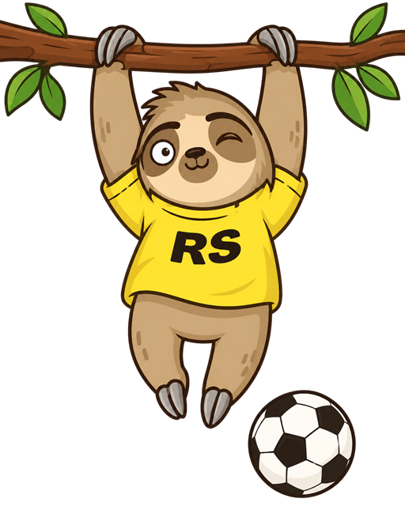

# Lazy Match — Memory Game

Игра на поиск пар с ленивцами RS School. Открывай карточки, запоминай, где кто сидит, и собирай все 8 пар за наименьшее число ходов.

**Деплой:** https://isaluk.github.io/memory-game/



## Возможности

- Поле 4×4: 16 карточек, 8 пар ленивцев, раскладка перемешивается при каждой загрузке и новой игре (алгоритм Фишера — Йейтса).
- Ход — открытие двух карточек. Совпавшая пара остаётся открытой, несовпавшая закрывается через 1 секунду, пока она открыта, другие карточки выбрать нельзя.
- Счётчики ходов и найденных пар.
- Кнопка «Новая игра» перезапускает игру сразу, даже если открыта несовпавшая пара.
- Окно победы с итоговым числом ходов и местом в таблице лидеров.
- Таблица лидеров: 10 лучших результатов (место, ходы, дата), хранится в `localStorage` и сохраняется после перезагрузки.
- Маскот RS School комментирует игру.
- Адаптивная вёрстка: десктоп, планшет, мобильный (от 380 px).
- Доступность: управление с клавиатуры, подписи для скринридеров, поддержка `prefers-reduced-motion`.

## Стек

- HTML, SCSS (БЭМ), JavaScript (ES-модули) — без фреймворков, библиотек и сборщиков.
- Вся разметка создаётся через `document.createElement`: в `<body>` файла `index.html` только `<script>`.
- Модальные окна — общий компонент на основе `<dialog>`.

## Структура

```
memory-game/
├── index.html
├── assets/        изображения и иконки
├── css/           скомпилированные стили
├── scss/          исходные стили: abstracts, base, blocks (БЭМ)
└── js/
    ├── main.js    точка входа, связывает компоненты и игру
    ├── components/ интерфейс: хедер, поле, карточка, табло, модалки
    ├── game/      правила игры и колода (без работы с DOM)
    ├── services/  хранение результатов в localStorage
    ├── data/      карточки, фразы маскота, иконки
    └── utils/     createElement, перемешивание, форматирование
```

## Локальный запуск

Приложение использует ES-модули, поэтому его нужно открывать через локальный сервер, а не двойным кликом по `index.html`.

1. Клонируйте репозиторий и перейдите в ветку `memory-game`:

   ```bash
   git clone https://github.com/isaluk/memory-game.git
   cd memory-game
   git checkout memory-game
   ```

2. Запустите любой локальный сервер в папке проекта, например:
   - VS Code: расширение **Live Server** → кнопка **Go Live**;
   - Node.js: `npx serve .`;
   - Python: `python -m http.server 5500`.

3. Откройте в браузере адрес, который покажет сервер (например, `http://localhost:5500`).

Скомпилированные стили уже лежат в `css/main.css`, сборка не нужна. Если вы меняете SCSS, скомпилируйте `scss/main.scss` в `css/main.css`, например расширением **Live Sass Compiler** для VS Code.

## Изображения

- Ленивцы на карточках, маскот и аватар победы созданы с помощью ИИ по мотивам маскота [RS School](https://rs.school/).
- Шрифты: Rubik, Rubik Dirt, Russo One, Orbitron — [Google Fonts](https://fonts.google.com/).
